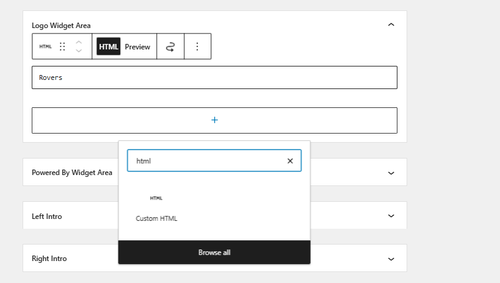

# Guide to add Header Menu

for header create new menu name header 
click the display location primary top bar and save the menu

# Guide to add footer menu

follow the step in image and add menu name footer
click the display location add related pages and save the menu

# Guide to add Additional Menu 1 

follow the step and add relative page for the top footer  and add the particular pages
click the Additional Menu 1 click the tick
And update manually 

Save and see result 

# Similarly add additional Menu 2,3,4

## the execpted similar will look similar like this 

# Guide to add post

fill the tittle

fill the description box with custom html and css for better styling 

Select the particular categories and fill the EXCERPT(summary)

Publish and save to see effect

# Guide to add page 

Just fill the title 

fill the description box with custom html and css for better styling 

Publish and save to see effect

# let's solve permalinks

in default 

to convert to like this " http://domainname/phpfreakz/htmlcss/overzicht-van-alle-html-kleurnamen/ "

follow the step mentioned in image

# let's add some logo and favicon 

first it must be activated 

select customize

select site identity

select logo and site icon 

# logo: text logo generated with nice google font

So in default the img phpfreakz image will show if you provide the logo text the text will load

But you need to add in html it will change the logo 

# bottom text logo aligned left, and on right side power by: rovers webdevelopment logo

So, For this I have made this also dynamic 

But you need to add in html

# blog items styling: like https://www.vijverinformatie.nl/ blog items styling (use default image if none available)

So, Yeah I have made this too for this to add featured image you have to set it in respective blog item

# bottom text : over phpfreakz replaced by page select

So, It has been replaced by page select 

# added the css variables 
So, It has been made the root css file is in header.php

# replace intro text: "Welkom op onze blog" benefits: "Gratis, Volledig Online, Support inbegrepen" button: "Neem contact op" 

For this I made a dynamic for this too add every field with custom html and write name

Image 1

Image 2

Similarly fill every field Left Intro, Right Intro you can use   too and call to action to

# make it easy to turn this intro on and off in code.

So, Here is an intro section just click the checkbox to on and off

# Every step Don't forget to update and see the changes.

